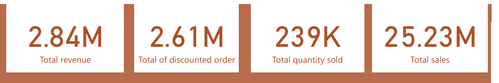
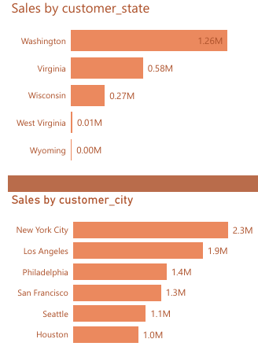
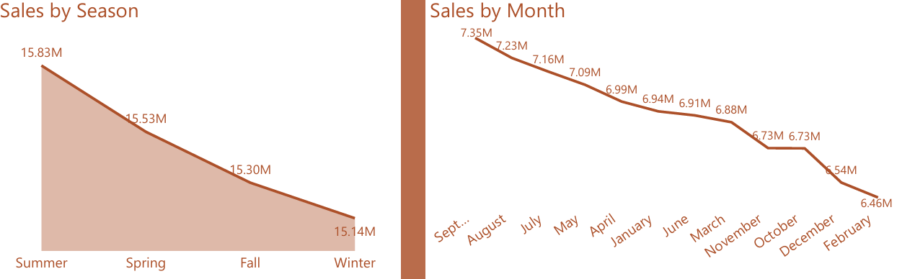
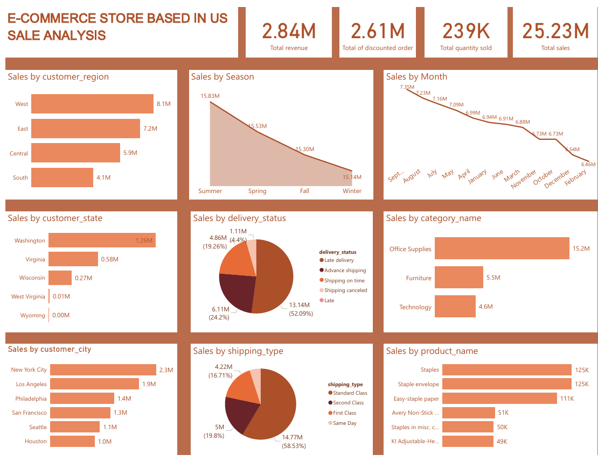
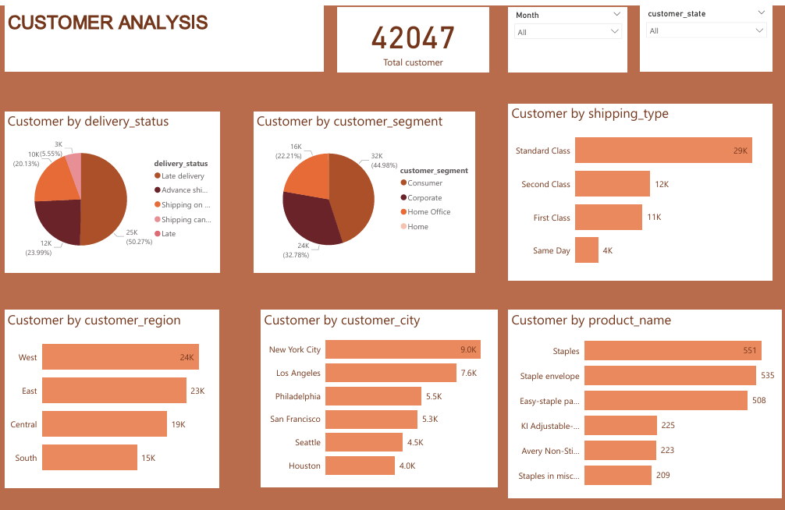

# E-commerce-store
  

## Intoduction
The goal of this project is to analyze and derive actionable insights from historical sales data for a "U.S.-based e-commerce store". By examining key metrics such as sales trends, customer behavior, and delivery performance, this analysis provides a deeper understanding of factors driving revenue and customer loyalty. The insights gained from this project can be leveraged to optimize marketing strategies, improve customer retention, and streamline operational efficiency.

The dataset covers various aspects including regional sales distribution, top-performing product categories, seasonal trends, shipping performance, and customer segmentation. Using tools like Power BI and Excel, this analysis offers valuable recommendations aimed at improving sales performance and driving long-term growth for the e-commerce store.

## Aim
To analyze the historical data of an e-commerce store to uncover key trends, customer behaviors, and operational insights, in order to provide actionable recommendations for improving sales, customer retention, and operational efficiency.

## Skills/concepts demonstrated

## Key finding
1. Sales Overview
- Total revenue generated: $25.23M, with 239k quantities sold across 42,047 customers.
- Discounted orders amounted to $2.61M, contributing to an overall revenue of $2.84M from the e-commerce store.

2.  Regional Sales Performance
- West: $8.1M in sales from 24k customers (top-performing region).
- East: $7.2M in sales from 23k customers.
- Central: $5.9M in sales from 19k customers.
- South: $4.1M in sales from 15k customers (lowest-performing region).

 3. Top Cities by Sales
- New York: $2.3M in sales from 9k customers (highest-performing city).
- Los Angeles: $1.9M from 7.6k customers.
- Philadelphia: $1.4M from 5.5k customers.
- San Francisco: $1.3M from 5.3k customers.
- Seattle: $1.1M from 4.5k customers.

4. State Performance
- Washington led with $1.26M in sales.
- States like Virginia and Wisconsin made $0.58M and $0.27M, respectively.
- West Virginia had the lowest sales at $0.01M.

  

  5. Product Categories
- Office Supplies: $15.2M (dominant category).
- Furniture: $5.5M.
- Technology: $4.6M.

  6. Seasonal Sales
- Summer was the highest-grossing season with $15.83M, followed closely by Spring ($15.53M), Winter ($15.4M), and Fall ($15.3M).

7. Top Months for Sales
- September: $7.35M.
- August: $7.23M.
- July: $7.16M.
- May: $7.09M.
- April: $6.99M.

  
  
8. Top Products by Sales
- Staples: 125k sales (highest).
- Staple Envelope: 125k.
- Easy Staple Paper: 111k.
- Avery Non-Stick Binder: 51k.
- Staples in Misc Colors: 50k.

 9.Delivery Status Performance
- Late Deliveries: 52% of sales ($13.14M).
- Advance Shipping: 24.2% ($6.11M).
- On-Time Shipping: 19.26% ($4.86M).
- Canceled Deliveries: 4.4% ($1.1M).

 10. Shipping Types
- Standard Class: 58.53% of sales ($14.77M).
- Second Class: 19.8% ($5M).
- First Class: 16.71% ($4.22M).
- Same-Day Shipping: 4.95% ($1.2M).

## Dashboard

## Recommendations
1.Sales and Seasonal Insights
- Capitalize on high-performing months (September, August, and July) by increasing marketing efforts and offering targeted promotions.
- Expand Sales During Low-Performing Months: Introduce discounts or special campaigns during months with lower sales to boost revenue.

2. Regional Strategy
- Focus on expanding customer reach in underperforming regions like the South by addressing logistical challenges and tailoring marketing campaigns to local demographics.
- Enhance operational efficiency in high-performing regions like the West to maintain dominance.

3. Product Optimization
- Continue prioritizing Office Supplies, which account for the majority of sales, while identifying opportunities to boost Furniture and Technology categories through cross-selling or bundling strategies.
- Promote top-performing products such as Staples and Easy Staple Paper to attract higher revenue.

4. Delivery and Shipping Improvements
-	Address late deliveries by partnering with reliable shipping providers and optimizing logistics operations.
- Encourage customers to opt for Standard or Same-Day shipping through discounts and incentives to improve satisfaction and reduce delays.

5. Customer Segmentation
-Develop personalized marketing campaigns for each customer segment, such as offering premium services to Corporate clients and cost-effective solutions to Consumers.
- Analyze and nurture high-value segments for greater customer retention and loyalty.

## Conclusion
This project provided a comprehensive analysis of the sales data for a U.S.-based e-commerce store, revealing key insights into sales performance, customer behavior, and operational efficiency. By analyzing regional trends, seasonal patterns, customer segmentation, and delivery performance, we were able to identify significant opportunities for improvement.

The findings highlighted the importance of focusing on high-performing regions and product categories, addressing logistical challenges to reduce late deliveries, and enhancing customer retention through personalized marketing and loyalty programs. Additionally, optimizing shipping options and expanding targeted campaigns during peak seasons can drive further growth.

In conclusion, the insights gathered from this analysis serve as a roadmap for strategic improvements, enabling the e-commerce store to strengthen its market position, increase customer satisfaction, and achieve sustainable long-term growth.

